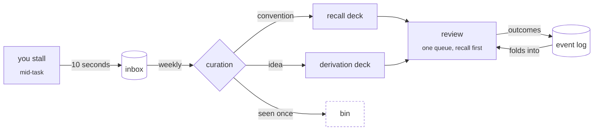
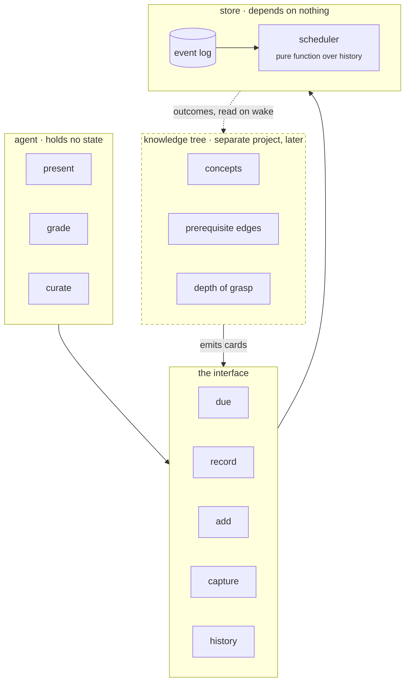
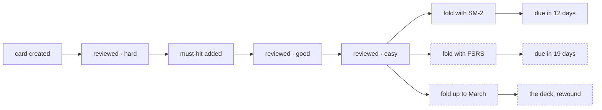

<pre align="center">
 ███╗   ██╗████████╗██╗  ██╗
 ████╗  ██║╚══██╔══╝██║  ██║
 ██╔██╗ ██║   ██║   ███████║
 ██║╚██╗██║   ██║   ██╔══██║
 ██║ ╚████║   ██║   ██║  ██║
 ╚═╝  ╚═══╝   ╚═╝   ╚═╝  ╚═╝
 ·  t h e   n t h   t i m e  ·
</pre>

<p align="center">
  <em>A spaced repetition system that treats arbitrary conventions and real reasoning as different problems.</em><br>
  <sub>Two decks, one queue, an append-only log, and a language model kept firmly out of the bookkeeping.</sub>
</p>

<p align="center">
  
  
  
  
</p>

---

> Nothing enters until you've hit it twice, on two different days.

---

## The gist

Most flashcard systems assume one kind of forgetting. There are two.

Some things are **arbitrary** — a library's argument order, whether your tokeniser peeks or consumes, what an inducer is. There's no *why* underneath. Trying to derive them costs you a session and gets you nowhere.

Other things are **derivable** — why left recursion loops, how a scope chain resolves. You don't want these memorised. You want to be able to rebuild them from scratch, out loud, in five minutes, a year from now.

Same forgetting curve. Completely different medicine.

```
        arbitrary  ───────►  recall deck      2 seconds    daily
       derivable  ───────►  derivation deck   5 minutes    weekly → monthly
```

The loop, end to end:



Three layers, each useful without the others:

| | what it knows | what it refuses to know |
|---|---|---|
| **store** | cards, outcomes, due dates | why any card exists |
| **tree** *(later)* | concepts, prerequisites, depth | anything about scheduling |
| **agent** | how to talk to you | nothing — it holds no state |

And a rule the whole thing hangs on: **capture is cheap, curation is strict.** Dump anything in ten seconds mid-task. Once a week, throw most of it away.

---

## The long version

<details>
<summary><strong>How the layers compose</strong></summary>

<br>

Everything meets at one narrow surface. Above it, clients. Below it, an append-only log and nothing else.



Read the arrows as dependencies. The store depends on nothing. The tree depends on the interface. The agent depends on both. **Nothing depends on the agent** — which is the property that makes it swappable, and the one most likely to get quietly violated the first time something feels convenient to stash in the front end.

The dotted return path is deliberately passive. No daemon, no notification, nothing polling. A teaching session's first act is to read the log; between sessions, nothing happens at all.

</details>

<details>
<summary><strong>Why two decks and not one</strong></summary>

<br>

Because mixing a five-minute card into a two-second deck destroys your willingness to open the deck at all. That's it. That's the entire practical argument, and it's enough.

The deeper argument is that the two modes ask different things of you. A recall card asks *do you have this*. A derivation card asks *can you still build this*. Reviewing them the same way means one of them is being done wrong.

They share a queue, though. One command. Recall comes first as a warm-up — it loads the vocabulary the derivation is about to need — and derivation comes after, never interleaved.

</details>

<details>
<summary><strong>How a derivation gets graded without it being vibes</strong></summary>

<br>

Every derivation card carries three or four **must-hits**: the claims a correct explanation has to assert.

For scope resolution, roughly: *start at the innermost environment · walk outward · stop at the first match · error if you fall off the end.*

You explain the thing cold. A model checks coverage against that list — not quality, not elegance, coverage. Which turns grading from a judgement call into a lookup, and lookups are the thing models are actually reliable at.

Two rules keep it honest. Must-hits are written as **claims, not phrasings**, so any wording that asserts the point counts. And the grader has to **quote the span of your explanation** that satisfies each one — if it can't point at the words, it can't tick the box. Models are sympathetic graders by default, and sympathy compounds into intervals that stretch further than you've earned.

Must-hits accrete. Miss a step that wasn't on the list, and the list grows. Over time each card takes the shape of your actual blind spots rather than someone's idea of a complete answer.

</details>

<details>
<summary><strong>Why the second-encounter rule</strong></summary>

<br>

You cannot predict what will recur. Nobody can. Every attempt to decide up front whether something is worth keeping is a small tax on attention paid at the worst possible moment — mid-task, mid-stall, mid-frustration.

So don't. Capture is dumb: raw text, a timestamp, no categories, back to work in ten seconds. The inbox is deliberately over-inclusive and most of it is noise.

The signal is hitting the same wall **twice, on two different days**. Once means nothing. Twice means it'll be a third time. Within a single session doesn't count — that's just the session.

Curation is where judgement lives, once a week, three questions per entry:

1. Idea or convention? *(convention → recall)*
2. Twice, across days? *(no → bin it, it'll come back)*
3. Real *why*, or arbitrary? *(arbitrary → recall, even when it feels conceptual)*

Everything past that is over-engineering.

</details>

<details>
<summary><strong>Why event sourcing, for a flashcard app</strong></summary>

<br>

Nothing is overwritten. Every review, every capture, every discard is an appended fact. Current state is a fold over the log.

This sounds like architecture cosplay until you notice what it buys:

**The scheduler becomes a pure function over history.** Because the log records *what happened* rather than *what was decided*, you can swap the interval algorithm and recompute every due date from the beginning of time — then compare the counterfactual against what actually occurred. A system that stored due dates directly can never do this. You'd be throwing away your history to change your mind.



Same history, three different questions asked of it. The solid path is today's state; the dotted ones cost nothing but a re-fold.

**Progress becomes visible for free.** Retention curves, which concepts rot fastest, whether derivation cards really do stretch further than recall ones, what fraction of captures survive curation. None of it designed for. All of it just sitting there.

**Rewind.** What did this deck look like in March.

One caveat, and it's the one thing replay can't save you from: the log is only as rich as what you wrote into it. Record pass/fail today and want a four-point scale next year, and the old history simply can't feed the new algorithm. Granularity is cheap going in and unrecoverable coming out.

</details>

<details>
<summary><strong>The layer that doesn't exist yet</strong></summary>

<br>

A knowledge tree: concepts, prerequisite edges, and a depth-of-grasp on each node.

It answers a different question than the deck does. The deck knows *what should I review today*. The tree knows *what should I learn next, and what am I missing in order to learn it* — so when you reach past a gap, it names the prerequisite and starts there instead.

It's a separate project that happens to be a client. It **emits** cards into the store and reads outcomes back out; it never touches an interval. The loop closes by pull, not push — no daemon, no notification, nothing running in the background. Whoever wakes up next reads the files.

It is also, transparently, the interesting problem and therefore the one most likely to eat the project. Which is why it's out of scope and stays that way until curation has been running long enough that missing prerequisites are a *felt* problem rather than an anticipated one.

</details>

<details>
<summary><strong>What's actually unresolved</strong></summary>

<br>

Plenty, and it's written down rather than glossed. Highlights:

- The system **has no way to detect a second encounter.** The rule that governs what enters at all currently depends on you remembering. That's a hole, not a decision.
- Outcome granularity, per the caveat above — the one call that replay can't undo.
- Whether must-hits stay bounded, or accrete until a card is unpassable.
- What a two-week gap does to the queue, which is the failure mode that kills every SRS.
- Whether the knowledge/derivation split survives contact with real curation, or whether most items sit ambiguously between the two.

See [`open-questions.md`](./open-questions.md). Tagged blocker / soon / deferred, because unresolved and urgent are different things.

</details>

---

## Status

Spec, not software. Two documents and an opinion.

The build order is deliberately unglamorous: append an event, fold the log, print what's due, record an outcome. If that runs from a bare shell with no model anywhere near it, the boundary between the store and everything else is in the right place — and if it doesn't, nothing layered on top will save it.

Before any of that, a week of running it by hand. Ten cards, a plain file, manual dates. The code here is an afternoon; what's unproven is whether the design fits the person.

---

<p align="center"><sub><em>recall is cheap · derivation is the point</em></sub></p>
